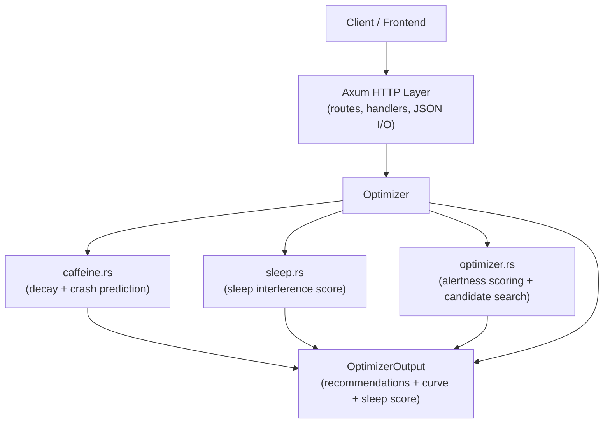

# stimstack-backend

Rust prototype backend for a caffeine schedule optimizer.

This app takes user caffeine constraints and dose sizes, then computes the best intake schedule for daytime alertness and healthy sleep.

## How it works

1. The client sends a JSON payload to `POST /optimize`.
2. The `axum` HTTP layer deserializes that payload into `OptimizerInput`.
3. The optimizer performs a brute-force grid search over 30-minute time slots.
4. For each candidate schedule, it computes:
   - caffeine decay and alertness via `caffeine.rs`
   - sleep interference via `sleep.rs`
   - a weighted schedule score in `optimizer.rs`
5. The best valid schedule is returned as `OptimizerOutput` with:
   - `recommended_doses`
   - `alertness_curve`
   - `sleep_score`
   - `predicted_crash`

## Architecture



> Note: `optimizer.rs` is the core engine. It discretizes the alertness window into 30-minute slots and generates valid dose schedules that respect hard constraints.

## Modules

- `src/main.rs`: axum server entrypoint and `/optimize` handler.
- `src/lib.rs`: library root exposing `model` and `math` modules.
- `src/model/constraints.rs`: safety settings like max daily mg, minimum gap, and caffeine cutoff time.
- `src/math/caffeine.rs`: pharmacokinetic-style decay model and crash-time predictor.
- `src/math/sleep.rs`: sleep quality estimator based on caffeine remaining at bedtime.
- `src/math/optimizer.rs`: schedule generation, scoring, and optimizer input/output definitions.

## Why this design

- **Rust** gives strong type safety and predictable performance for backend scheduling logic.
- **Axum** provides a lightweight JSON API layer.
- **Brute-force grid search** is easy to reason about and fast enough for a few doses over a day.
- **Explainable output** means users get not only a schedule but also an alertness curve and sleep score.

## Run locally

```bash
cargo build
cargo run
```

The server listens on `http://127.0.0.1:3000`.

## Example request

```bash
curl -sS -X POST http://127.0.0.1:3000/optimize \
  -H 'Content-Type: application/json' \
  -d '{"half_life_hours":5.0,"constraints":{"max_daily_mg":400.0,"min_gap_hours":4.0,"no_caffeine_after":"2026-05-25T20:00:00Z"},"alertness_window":["2026-05-25T09:00:00Z","2026-05-25T17:00:00Z"],"sleep_time":"2026-05-25T23:00:00Z","dose_sizes":[95.0,95.0]}'
```

## Docker

```bash
docker build -t stimstack-backend:latest .
docker run -p 3000:3000 stimstack-backend:latest
```
